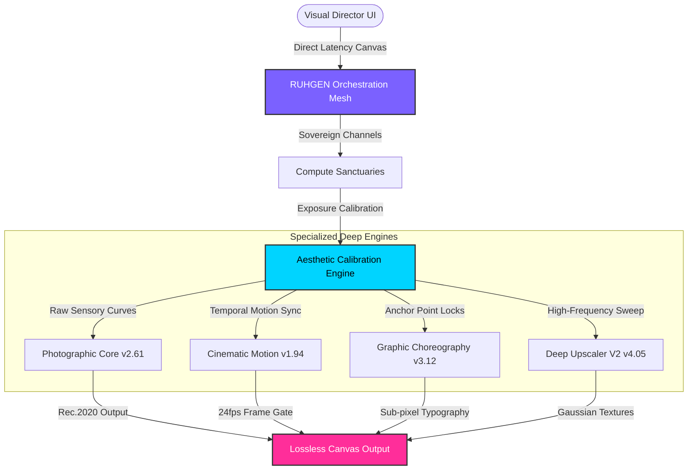

# <p align="center"></p>

# <p align="center">⚡ R U H G E N ⚡</p>
<p align="center">
  <strong>The prestige-grade orchestration mesh for elite creative directors.</strong>
</p>

<p align="center">
  
  
  
  
</p>

---

## 🔍 Prologue: A Category of One
Professional creative tools shouldn't feel like toys. In a landscape saturated with generic prompt boxes and fragmented workflows, design and editorial directors are constantly forced to bridge disconnected engines, styles, and parameters manually. 

**RUHGEN** is a high-end, unified orchestration framework designed to unify the world's most powerful AI engines under one fluid, real-time visual timeline. Aligned strictly to cinematic grading standards, our ecosystem provides the **prestige-grade guardrails**, secure computation paths, and absolute style consistency required by design firms shipping high-value brand assets.

---

## 💎 The Pillars of Prestige

| Pillar | Metric | Operational Value |
| :--- | :--- | :--- |
| **01. Visual Cohesion Engine** | `0.02% drift / 10k generations` | Prevents style decay and locks dynamic visual signatures natively across infinite asset versions. |
| **02. Direct-Latency Pipeline** | `180ms roundtrip latency` | Immediate feedback loops calibrated for high-pressure pitch decks, temporal sequencing, and live director reviews. |
| **03. Secure Compute Sanctuaries** | `100% Sovereign Compute` | Runs isolated, high-tier secure tunnels. Creative parameters, layout matrices, and outputs are fully sovereign and immune to scraping. |

---

## 🧬 Architectural Topology
The RUHGEN mesh coordinates distinct deep learning engines behind a single unified interface. It routes data through secure channels, applying visual constraints and exposure sweeps at the orchestration layer before delivering pixel-perfect, lossless assets.



---

## 🛠️ The Constellation of Engines

RUHGEN bridges four dedicated, low-overhead model blocks designed for high-end graphic layout and cinema:

### 📸 Photographic Core (`v2.61`)
* **Focus:** Medium-format RAW sensor calibration.
* **Operation:** Calibrated strictly for micro-contrast curves, organic skin tone distributions, and realistic highlights. Locks spatial parameters to achieve a authentic photography profile with zero styling drift.
* **Spectrum:** Full Rec.2020 color gamut mapping.

### 🎬 Cinematic Motion (`v1.94`)
* **Focus:** 24fps Temporal keyframe orchestration.
* **Operation:** Schedules temporal motion vectors across sequential frames. Completely locks camera panning paths, tracking movements, and perspective shifts to match elite analog cinema decks.

### 📐 Graphic Choreography (`v3.12`)
* **Focus:** Sub-pixel typographic outlines & high-contrast grid layouts.
* **Operation:** Enforces rigid vector boundaries. Maps intricate print-ready layouts, typography outlines, and graphic compositions without visual compression artifacts.

### 🔍 Deep Upscaler V2 (`v4.05`)
* **Focus:** High-pass frequency restoration & grain reconstruction.
* **Operation:** Reconstructs micro-level details (concrete dust, fabric weave, individual hair strands) using dynamic Gaussian synthesis, completely bypassing synthetic noise hallucinations.

---

## ⚡ Quickstart: Running RUHGEN

RUHGEN consists of a modern **Next.js** frontend and a dedicated **Express/Node.js** high-performance API backend.

> [!NOTE]
> Ensure you have **Node.js v20+** installed on your system before proceeding.

### 1. Environment Configuration
Create a `.env` file in the root directory:
```env
# Client Configuration
NEXT_PUBLIC_API_URL=http://localhost:4000
NEXT_PUBLIC_ENVIRONMENT=development

# Server Credentials & Encryption Keys
JWT_SECRET=your_jwt_sovereign_secret_key
SESSION_TOKEN_LIFETIME=24h
```

### 2. Install Workspace Dependencies
RUHGEN utilizes standard monorepo orchestration to load client and server packages:
```bash
npm install
```

### 3. Sync Platform Media & Static Assets
Initialize the media vaults, synchronizing default profiles and visual assets:
```bash
npm run sync:media
```

### 4. Boot Dev Environment (Next.js + Express Backend)
Launch both services concurrently inside a single terminal using the unified dev bootstrapper:
```bash
npm run dev
```
* **Frontend Canvas:** [http://localhost:3000](http://localhost:3000)
* **Backend Mesh Node:** [http://localhost:4000](http://localhost:4000)

---

## 💻 Script Registry

The following workspace commands are pre-registered in `package.json` for operations management:

```bash
# Start concurrently Next.js frontend + Node/Express backend dev services
npm run dev

# Run individual developer services
npm run dev:next     # Next.js Server only
npm run dev:backend  # Express REST API Node only

# Pre-compile assets and compile production-ready distribution bundles
npm run build

# Synchronize marketing/community graphics & system presets
npm run sync:media

# System Cache Maintenance & Diagnostics
npm run clear:data   # Flush local database caches and mock nodes
```

---

## 🔒 Hardened Compute Protocols

RUHGEN is engineered from the ground up to respect creative ownership and visual intellectual property:
* **Zero Scraping Vector:** Computations executed in our secure sanctuaries bypass standard web crawlers. Your visual parameters remain isolated.
* **Lossless Transit Output:** Downstream visual pipelines benefit from uncompressed asset compilation, exporting premium TIFF, high-bit PNG, or raw format sequences.
* **Dynamic Parameter Encapsulation:** Unlike traditional systems that share prompts publicly, RUHGEN encapsulates inputs within zero-leak secure session hashes.

---

<p align="center">
  Designed by and for the next generation of visual directors. <br />
  <strong>RUHGEN Systems // 2026</strong>
</p>
