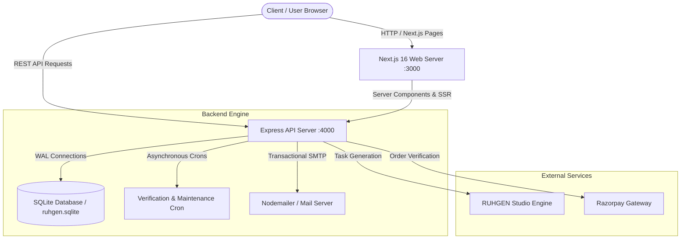

# RUHGEN — Enterprise AI-Powered Creative Media & Studio Platform

[](https://nextjs.org/)
[](https://reactjs.org/)
[](https://nodejs.org/)
[](https://www.typescriptlang.org/)
[](https://www.sqlite.org/)
[](#license)

**RUHGEN** is a full-stack, enterprise-grade creative studio and content management platform engineered for digital artists, creative directors, and media production teams. Combining high-performance AI generation workflows, dynamic credit allocation, community showcase feeds, educational resources, and administrative control systems, RUHGEN provides an end-to-end environment for professional visual asset creation.

---

## 📋 Table of Contents

- [Overview](#overview)
- [Why RUHGEN Exists](#why-ruhgen-exists)
- [Target Audience](#target-audience)
- [Key Features](#key-features)
- [Technology Stack](#technology-stack)
- [Architecture Overview](#architecture-overview)
- [Project Structure](#project-structure)
- [Installation & Local Setup](#installation--local-setup)
- [Environment Configuration](#environment-configuration)
- [Running Locally](#running-locally)
- [Production Deployment](#production-deployment)
- [Security Considerations](#security-considerations)
- [Contribution Guidelines](#contribution-guidelines)
- [License](#license)
- [Roadmap](#roadmap)

---

## 🔍 Overview

RUHGEN bridges the gap between disparate model architectures and production-grade media workflows. Rather than forcing creators to switch between isolated prompt tools and external asset managers, RUHGEN offers a unified platform with:

- **Generation Studio**: High-resolution image and video creation with custom parameter tuning.
- **Credit & Billing Engine**: Tiered subscription plans, automated credit deductions, transaction ledgers, and secure Razorpay payment processing.
- **Community Hub**: Interactive feeds for discovering, liking, saving, commenting on, and sharing member-created artwork.
- **Academy & Resources**: Structured video tutorials, guides, and platform masterclasses.
- **Administration Suite**: Administrative dashboard for managing user accounts, site content, support tickets, credit balances, and security audit logs.

---

## 🎯 Why RUHGEN Exists

Modern creative pipelines often suffer from fragmented tooling, unpredictable credit management, lack of team visibility, and complex asset orchestration. RUHGEN solves these challenges by providing:

1. **Unified Studio Workflow**: A single, intuitive dashboard for image and video production with real-time feedback.
2. **Transparent Resource Management**: Real-time balance tracking, credit transaction logs, and clear usage limits across Free, Pro, and Enterprise tiers.
3. **Content Governance**: Built-in moderation, admin user management, support ticketing, and detailed audit trails.
4. **Self-Contained Architecture**: Standalone SQLite database with write-ahead logging (WAL) for rapid local execution or cloud VPS deployments.

---

## 👥 Target Audience

- **Creative & Art Directors**: For rapid mood boarding, look development, and client pitch preparation.
- **Digital Artists & Designers**: For high-resolution asset generation and community exhibition.
- **Marketing & Content Teams**: For producing high-converting visual media at scale.
- **Production Studios**: For integrating scalable generation APIs into broader asset management pipelines.

---

## ✨ Key Features

### 🎨 Generation Studio
- **Multi-Modal Output**: Generate photorealistic imagery and cinema-grade short video sequences.
- **Custom Aspect Ratios & Presets**: Cinema (16:9), Portrait (9:16), Square (1:1), and Ultrawide (21:9) configurations.
- **Task Tracking**: Background asynchronous job execution with real-time status polling.

### 💳 Credit & Billing Systems
- **Tiered Plans**: Free, Pro, Pro Plus, and Custom Enterprise subscriptions.
- **Razorpay Integration**: Native checkout flow with signature verification and webhook capabilities.
- **Transaction Audit Log**: Immutable record of credit additions, usage deductions, and administrative overrides.

### 🌐 Community Exhibition & Social Features
- **Public Feed & Gallery**: Explore curated community creations with tag filtering.
- **Member Interactivity**: Like posts, save to personal collections, add comments, and track view metrics.
- **Media Publishing**: Directly share Studio generations to the community feed with customizable prompts and metadata.

### 🎓 RUHGEN Academy
- **Video Tutorials**: Structured tutorials categorized by difficulty level (Beginner, Intermediate, Advanced).
- **Interactive Guides**: Masterclass content detailing prompt engineering, lighting, and style framing techniques.

### 🛡️ Admin Dashboard & Control Center
- **User Governance**: View registered members, modify credit balances, manage roles, or suspend accounts.
- **Content Management System (CMS)**: Dynamically edit homepage banners, showcase videos, visualizer presets, and pricing plans.
- **Support Desk**: Integrated ticketing system for responding to member inquiries with attachment uploads.
- **Audit Trails**: Security logs recording email verifications, credit alterations, and security events.

### ✉️ Email Verification & Lifecycle System
- **Transactional Emails**: Verification links, 6-digit OTP codes, and automated reminder crons.
- **Grace Period Enforcement**: Automated background scheduler handling account verification deadlines.

---

## 💻 Technology Stack

### Frontend Architecture
- **Framework**: [Next.js 16](https://nextjs.org/) (App Router)
- **UI Library**: [React 19](https://react.js.org/) & [TypeScript](https://www.typescriptlang.org/)
- **Styling**: Vanilla CSS, Modern CSS Custom Properties, and [Tailwind CSS 4](https://tailwindcss.com/)
- **Icons & Animations**: [Lucide React](https://lucide.dev/) & [Framer Motion 12](https://www.framer.com/motion/)

### Backend Architecture
- **Runtime**: [Node.js](https://nodejs.org/) (v20+ recommended)
- **Web Framework**: [Express.js](https://expressjs.com/)
- **Database Engine**: [better-sqlite3](https://github.com/WiseLibs/better-sqlite3) (SQLite3 with WAL mode)
- **Authentication**: JWT (JSON Web Tokens) & Password Hashing
- **Email Delivery**: [Nodemailer](https://nodemailer.com/) (SMTP with SSL/TLS support)
- **Payments**: [Razorpay Node SDK](https://razorpay.com/)
- **File Uploads**: [Multer](https://github.com/expressjs/multer) (Memory storage buffer)

---

## 🧬 Architecture Overview

RUHGEN runs as a decoupled architecture where the Next.js frontend handles public rendering, marketing layouts, dynamic client components, and administrative UI, while the Node.js/Express backend controls database mutations, authentication, external API routing, and cron tasks.



---

## 📁 Project Structure

```text
RUHGEN/
├── backend/                  # Node.js + Express API Backend
│   ├── data/                 # SQLite DB storage (ruhgen.sqlite) & site JSON data
│   └── src/
│       ├── middleware/       # Rate limiters, Admin auth, Error handlers
│       ├── academy-routes.js # Academy tutorial endpoints
│       ├── admin-content-routes.js # CMS dynamic site content editing
│       ├── admin-users-routes.js   # User administration & audit logs
│       ├── community-routes.js     # Posts, likes, comments, saves
│       ├── db.js             # SQLite initialization & database migrations
│       ├── payment-routes.js # Razorpay integration & webhook handlers
│       ├── server.js         # Express app entrypoint & graceful shutdown
│       ├── studio-routes.js  # Generation tasks & credits handling
│       ├── support-routes.js # Ticket desk API routes
│       ├── user-auth-routes.js    # Member registration, login, profile
│       └── verification-cron.js  # Scheduled background verification tasks
├── media/                    # Media uploads (synced to public/media)
├── public/                   # Static public web assets (images, icons, media)
├── scripts/                  # Administrative utility scripts
│   ├── cleanup-unused-media.cjs  # Purges orphan media files
│   ├── clear-local-data.cjs      # Clears SQLite cache for fresh testing
│   └── sync-media.cjs            # Syncs root media/ into public/media/
├── src/                      # Next.js Frontend Application
│   ├── app/                  # App Router pages and API routes
│   │   ├── admindashboard/   # Admin UI routes (Content, Users, Support)
│   │   ├── dashboard/        # Member Studio dashboard & settings
│   │   ├── (marketing)/      # Public pages (Features, Pricing, Academy, etc.)
│   │   ├── globals.css       # Design tokens, theme colors, CSS variables
│   │   └── layout.tsx        # Root HTML layout & global navigation
│   ├── backend/              # Server-side data repository helpers
│   ├── components/           # UI components, Modals, Navbars, Footers
│   ├── hooks/                # Custom React hooks
│   └── lib/                  # Auth storage, API clients, and constants
├── Dockerfile                # Production Docker container configuration
├── docker-compose.yml        # Docker Compose service orchestration
├── ecosystem.config.js       # PM2 production process configuration
├── nginx.conf                # Nginx production reverse-proxy configuration
├── package.json              # Monorepo dependencies & scripts
└── README.md                 # Project documentation
```

---

## ⚙️ Environment Configuration

Copy `.env.example` to `.env` in the root directory:

```bash
cp .env.example .env
```

### Environment Variables Matrix

| Parameter | Type | Required | Description | Default |
| :--- | :--- | :--- | :--- | :--- |
| `PORT` | Number | Yes | Next.js frontend port | `3000` |
| `BACKEND_PORT` | Number | Yes | Express API backend port | `4000` |
| `BACKEND_URL` | String | Yes | Internal API URL used by Next.js SSR | `http://127.0.0.1:4000` |
| `NEXT_PUBLIC_SITE_URL` | String | Yes | Public canonical URL for links | `http://localhost:3000` |
| `ADMIN_JWT_SECRET` | String | Yes | JWT secret key for Admin sessions | *Configurable* |
| `USER_JWT_SECRET` | String | Yes | JWT secret key for User sessions | *Configurable* |
| `QWEN_API_KEY` | String | Yes | Qwen / NVIDIA GenAI API Key for Image Studio | *Configurable* |
| `SMTP_HOST` | String | No | Mail server hostname | `mail.ruhgen.in` |
| `SMTP_PORT` | Number | No | SMTP port (465 SSL or 587 TLS) | `465` |
| `SMTP_USER` | String | No | SMTP authentication username | `verify@ruhgen.in` |
| `SMTP_PASS` | String | No | SMTP authentication password | *Configurable* |
| `RAZORPAY_KEY_ID` | String | No | Razorpay Key ID for payments | `rzp_test_...` |
| `RAZORPAY_KEY_SECRET` | String | No | Razorpay Secret for payments | *Configurable* |

---

## 🚀 Running Locally

### 1. Install Dependencies
Run from the repository root:

```bash
npm install
cd backend && npm install && cd ..
```

### 2. Synchronize Assets
Initialize the media storage folders:

```bash
npm run sync:media
```

### 3. Start Development Services
Launch both the Next.js frontend and Express backend concurrently:

```bash
npm run dev
```

- **Frontend Interface**: [http://localhost:3000](http://localhost:3000)
- **Backend API Engine**: [http://localhost:4000](http://localhost:4000)
- **Health Check Endpoint**: [http://localhost:4000/api/health](http://localhost:4000/api/health)

---

## 📦 Workspace Command Registry

```bash
# Start Next.js + Express backend concurrently in development mode
npm run dev

# Run Next.js frontend only
npm run dev:next

# Run Express backend only
npm run dev:backend

# Compile production bundles
npm run build

# Synchronize root media assets into public/media
npm run sync:media

# Maintenance: Reset local SQLite database for clean test runs
npm run clear:data
```

---

## 🌐 Production Deployment

### Option A: PM2 + Nginx on Linux VPS (Ubuntu / Debian)

1. **Build Application**:
   ```bash
   npm ci
   cd backend && npm ci && cd ..
   npm run build
   ```

2. **Launch with PM2**:
   ```bash
   pm2 start ecosystem.config.js --env production
   pm2 save
   ```

3. **Nginx Reverse Proxy**:
   Copy `nginx.conf` to your Nginx sites configuration directory and enable SSL via Certbot:
   ```bash
   sudo cp nginx.conf /etc/nginx/sites-available/ruhgen
   sudo ln -s /etc/nginx/sites-available/ruhgen /etc/nginx/sites-enabled/
   sudo nginx -t && sudo systemctl reload nginx
   sudo certbot --nginx -d yourdomain.com
   ```

### Option B: Docker & Docker Compose

Deploy using containerization:

```bash
docker-compose up -d --build
```

---

## 🔒 Security Considerations

- **Rate Limiting**: Configured via `express-rate-limit` on authentication endpoints (`/api/auth/login`, `/api/auth/register`, `/api/admin/auth/login`) to mitigate brute-force attacks.
- **SQL Parameterization**: All SQLite operations use parameterized statements with `better-sqlite3`, preventing SQL injection vulnerabilities.
- **Sanitized Media Operations**: Uploaded file paths undergo path normalization and bounds validation to prevent directory traversal attempts.
- **Encrypted Password Storage**: Passwords are standardly hashed before being committed to persistent storage.
- **Graceful Shutdown**: The Express API intercepts `SIGINT` and `SIGTERM` signals to close active database connections and complete pending tasks safely.

---

## 🤝 Contribution Guidelines

1. **Fork & Branch**: Create a feature branch off `master` (`git checkout -b feature/your-feature`).
2. **Code Style**: Ensure code conforms to TypeScript and ESLint standards (`npm run lint`).
3. **Commit Messages**: Write clear, descriptive commit messages.
4. **Pull Requests**: Submit PRs with a clear summary of changes and test steps.

---

## 📄 License

Distributed under the MIT License. See `LICENSE` for more information.

---

## 🛣️ Roadmap

- [ ] **Webhook Gateway**: Real-time event notifications for downstream integrations.
- [ ] **Multi-Tenant Teams**: Shared organizational credit pools and workspace controls.
- [ ] **Batch Generation**: Bulk asset production queues for enterprise workflows.
- [ ] **Expanded Payment Providers**: International multi-currency support (Stripe, PayPal).
