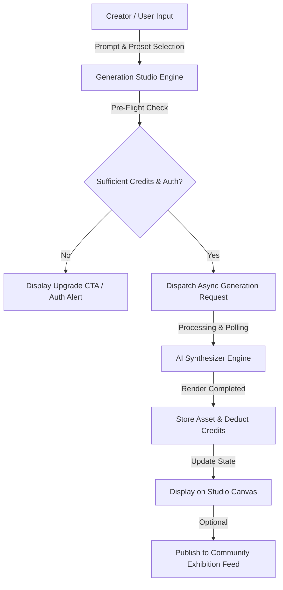
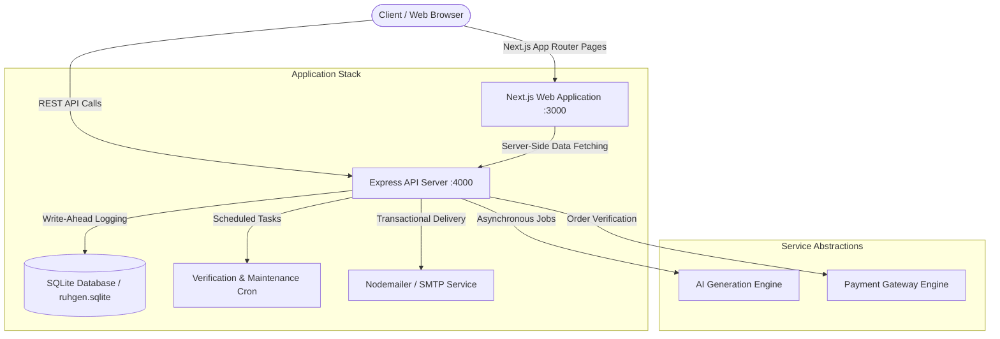

# RUHGEN — Enterprise AI-Powered Creative Media & Studio Platform

[](https://nextjs.org/)
[](https://reactjs.org/)
[](https://nodejs.org/)
[](https://www.typescriptlang.org/)
[](https://www.sqlite.org/)
[](#license)

**RUHGEN** is an enterprise-grade multi-modal AI generation studio, digital asset management environment, and content management platform engineered for digital artists, creative directors, and media production teams. Combining high-performance image and video generation workflows, real-time credit allocation, community exhibition feeds, masterclass educational resources, and an administrative control studio, RUHGEN delivers a unified end-to-end environment for modern visual asset production.

---

## 📋 Table of Contents

- [Overview](#overview)
- [The Problem](#the-problem)
- [The Solution](#the-solution)
- [Core Features](#core-features)
- [What Makes RUHGEN Different](#what-makes-ruhgen-different)
- [User Workflows & Journey](#user-workflows--journey)
- [Technology Stack](#technology-stack)
- [System Architecture](#system-architecture)
- [Project Structure](#project-structure)
- [Local Development & Setup](#local-development--setup)
- [Environment Variable Architecture](#environment-variable-architecture)
- [Security Architecture](#security-architecture)
- [Administrative Control & CMS](#administrative-control--cms)
- [SEO, Discoverability & Performance](#seo-discoverability--performance)
- [Quality Assurance & Build Verification](#quality-assurance--build-verification)
- [Official Social Links](#official-social-links)
- [License](#license)

---

## 🔍 Overview

Modern digital creative pipelines require rapid iteration, high-fidelity visual feedback, and seamless asset orchestration. RUHGEN bridges the gap between raw model endpoints and production-ready creative software.

Rather than forcing creators to switch between isolated prompt tools, standalone image generators, separate video platforms, and external storage managers, RUHGEN unifies the visual synthesis lifecycle into a single, cohesive web application:

- **Generation Studio**: High-resolution image and cinema-grade video creation with real-time parameter tuning and visualizer presets.
- **Credit & Ledger Engine**: Automated credit deductions, usage transaction logs, and flexible subscription tiers.
- **Community Exhibition Hub**: Interactive social gallery for publishing, discovering, saving, commenting on, and sharing member artwork.
- **RUHGEN Academy**: Structured video tutorials, prompt framing guides, and lighting masterclasses for creator skill advancement.
- **Administrative Control Studio**: Dedicated admin console for user governance, dynamic CMS content updates, support ticket processing, and security audit logs.

---

## ⚡ The Problem

Creative teams and digital artists operating in modern media environments face critical operational bottlenecks:

1. **Fragmented Tooling**: Creators waste time navigating across multiple single-purpose generation platforms with inconsistent prompt interfaces and asset formats.
2. **Opaque Usage & Cost Tracking**: Many generative platforms obscure per-generation token costs, leading to unexpected credit depletion without clear transaction visibility.
3. **Disconnected Community & Portfolio Workflows**: Generated assets often sit isolated on local disks or temporary discord channels rather than being organized into exhibitable portfolios.
4. **Rigid Platform CMS Control**: Administrators frequently lack real-time control over homepage showcases, dynamic pricing tiers, hero media backgrounds, and support ticket queues without performing full codebase re-deployments.

---

## 💡 The Solution

RUHGEN addresses these challenges by offering a centralized, enterprise-grade generation environment backed by a robust REST architecture, write-ahead logged SQLite persistence, and an interactive CMS.

### End-to-End Execution Flow



---

## ✨ Core Features

### 🎨 Multi-Modal Generation Studio
- **Dual-Engine Synthesis**: Seamlessly switch between high-resolution Image generation and cinematic Video generation within a single workspace.
- **Preset Calibration & Framing**: Pre-configured aspect ratios (16:9 Cinema, 9:16 Portrait, 1:1 Square, 21:9 Ultrawide) and visualizer presets (lens parameters, gap settings, ISO controls).
- **Asynchronous Task Processing**: Asynchronous job handling with real-time status polling, progress indicators, and immediate canvas rendering.
- **Interactive Image Editing**: Support for image-to-image prompts, variation synthesis, and high-resolution upscaling.

### 💳 Transparent Credit & Billing Engine
- **Tiered Subscription Plans**: Flexible plan structures (Free, Pro, Pro Plus, Enterprise) tailored to individual creators and production teams.
- **Real-Time Cost Preview**: Interactive cost calculation that adjusts based on chosen model tier, aspect ratio, and resolution prior to execution.
- **Transaction Audit Ledger**: Immutable record of credit additions, usage deductions, plan changes, and administrative credit overrides.

### 🌐 Community Exhibition & Social Hub
- **Exhibition Feed**: Browse top community-generated visual art filtered by category (`cinematic`, `sci-fi`, `art`, `realistic`).
- **Creator Interactivity**: Support for liking posts, saving creations into personal collections, adding comments, and tracking view analytics.
- **One-Click Publishing**: Direct option within the Generation Studio to share rendered assets to the public exhibition feed with custom prompt metadata.

### 🎓 RUHGEN Academy
- **Curated Masterclasses**: Comprehensive video tutorials and guides covering advanced prompt framing, lighting styles, camera movement parameters, and style consistency.
- **Skill Progression Paths**: Structured categorization by difficulty level (Beginner, Intermediate, Advanced) to accelerate creator onboarding.

### 🛡️ Administrative Control Studio & CMS
- **Single Authorized Admin Account**: Protected administrative console guarded by PBKDF2 salt-hashed password verification and JWT token authorization.
- **Dynamic Content Management (CMS)**: Live editing for homepage hero backgrounds, showcase video slides, pricing plans, feature calibration assets, and official social media links.
- **User Governance**: Account status monitoring (Active, Pending, Suspended), email verification management, and manual credit balance adjustments.
- **Support Desk Ticketing**: Integrated support queue for reading user inquiries, downloading attachments, and sending admin responses.
- **Security Audit Logs**: Track account creation timestamps, password changes, verification deadlines, and administrative security events.

---

## 🚀 What Makes RUHGEN Different

| Aspect | Traditional Generation Tools | RUHGEN Platform |
| :--- | :--- | :--- |
| **Workspace Integration** | Isolated tools for image vs video | Unified multi-modal studio for both media types |
| **Cost Transparency** | Hidden per-prompt token formulas | Live per-generation credit cost preview |
| **Content Flexibility** | Static, hardcoded landing page assets | Database-backed CMS for instant dynamic site updates |
| **Community Connection** | Disconnected local file downloads | Integrated community exhibition feed with one-click sharing |
| **Administrative Control** | Manual database script overrides | Comprehensive Admin Control Studio with audit logging |
| **Architecture** | Heavy external service locking | Self-contained, hosting-independent application stack |

---

## 🔄 User Workflows & Journey

### 1. Creator Workflow
1. Creator registers an account and verifies email.
2. Navigates to the **Generation Studio** (`/dashboard/generate/image` or `/dashboard/generate/video`).
3. Selects aspect ratio, visualizer preset, and model quality tier while viewing live credit costs.
4. Submits the prompt. The system validates balance, deducts credits, and renders the media.
5. The rendered asset appears on the interactive studio canvas for download or publishing.

### 2. Community Workflow
1. Member explores the **Community Hub** (`/community`) to discover trending creator work.
2. Filters by style category, likes posts, saves assets to personal collections, or joins discussion threads.

### 3. Admin Workflow
1. Operator signs in via `/admin/login` using administrative credentials.
2. Accesses the **Admin Control Studio** (`/admindashboard`).
3. Updates site pricing, hero backgrounds, or social links in the CMS tab (`/admindashboard/content`).
4. Monitors user accounts (`/admindashboard/users`), manages support tickets (`/admindashboard/support`), or reviews system logs.

---

## 💻 Technology Stack

### Frontend Architecture
- **Framework**: [Next.js 16](https://nextjs.org/) (App Router, Server Components & Dynamic SSR)
- **UI Library**: [React 19](https://react.dev/) & [TypeScript 5](https://www.typescriptlang.org/)
- **Styling**: Vanilla CSS, Theme CSS Custom Properties, and [Tailwind CSS 4](https://tailwindcss.com/)
- **Animations & Icons**: [Framer Motion 12](https://www.framer.com/motion/) & [Lucide React](https://lucide.dev/)

### Backend Architecture
- **Runtime**: [Node.js](https://nodejs.org/) (v20+ recommended)
- **Web Server**: [Express.js](https://expressjs.com/)
- **Database**: [better-sqlite3](https://github.com/WiseLibs/better-sqlite3) (SQLite with Write-Ahead Logging `WAL` mode)
- **Authentication**: Session JWTs (JSON Web Tokens) & PBKDF2 Password Hashing
- **Email Service**: [Nodemailer](https://nodemailer.com/) (SMTP with SSL/TLS)
- **File Upload Handling**: [Multer](https://github.com/expressjs/multer) (Memory storage buffer with safe path sanitization)

---

## 🧬 System Architecture

RUHGEN operates on a decoupled architecture separating public rendering and client interactions (Next.js) from persistent database operations, background cron jobs, and authentication guards (Express API Engine).



---

## 📁 Project Structure

```text
RUHGEN/
├── backend/                  # Express API Backend Engine
│   ├── data/                 # SQLite DB file (ruhgen.sqlite) & site JSON content
│   └── src/
│       ├── middleware/       # Rate limiters, Admin RBAC guards, input validators
│       ├── academy-routes.js # Academy tutorials & lesson endpoints
│       ├── admin-content-routes.js # CMS dynamic site content routes
│       ├── admin-users-routes.js   # User management & security audit routes
│       ├── auth.js           # PBKDF2 hashing, JWT signing, admin seeding
│       ├── config.js         # Centralized environment variable resolution
│       ├── db.js             # SQLite initialization & schema migrations
│       ├── payment-routes.js # Payment processing & transaction ledgers
│       ├── server.js         # Express app entrypoint & graceful shutdown
│       ├── studio-routes.js  # Async generation job handlers & credit balance
│       ├── support-routes.js # Support ticket API endpoints
│       └── verification-cron.js  # Background account verification deadline scheduler
├── data/                     # Root seed data & fallback content definitions
├── media/                    # Media upload directory (synced to public/media)
├── public/                   # Static public assets (images, SVGs, favicon)
├── scripts/                  # Maintenance utility scripts
│   ├── clear-local-data.cjs  # Database purge utility for clean test environments
│   └── sync-media.cjs        # Synchronizes root media folder into public directory
├── src/                      # Next.js Frontend Source Code
│   ├── app/                  # App Router pages and route handlers
│   │   ├── admin/            # Admin sign-in route
│   │   ├── admindashboard/   # Admin Control Studio routes (Content, Users, Support)
│   │   ├── dashboard/        # Member Studio dashboard, settings, & generation UI
│   │   ├── (marketing)/      # Public pages (Features, Pricing, Academy, FAQ, etc.)
│   │   ├── globals.css       # Core design tokens, dark/light theme variables
│   │   ├── layout.tsx        # Root HTML layout with font loading
│   │   ├── robots.ts         # Automated search engine robots.txt configuration
│   │   └── sitemap.ts        # Automated sitemap XML generation
│   ├── backend/              # Server-side content repositories & default fallbacks
│   ├── components/           # Reusable UI components, Modals, Navbars, Footers
│   ├── hooks/                # Custom React state hooks
│   └── lib/                  # Navigation links, layout constraints, API helpers
├── .env.example              # Environment variables template file
├── package.json              # Monorepo dependencies & scripts configuration
└── README.md                 # Project documentation
```

---

## ⚙️ Local Development & Setup

### Prerequisites
- **Node.js**: v20.0.0 or higher
- **npm**: v10.0.0 or higher

### 1. Clone & Install Dependencies
Run from the repository root:

```bash
# Install root frontend dependencies
npm install

# Install backend service dependencies
cd backend && npm install && cd ..
```

### 2. Environment Configuration
Copy `.env.example` to `.env` in the root directory:

```bash
cp .env.example .env
```

### 3. Synchronize Media Assets
Initialize public media assets:

```bash
npm run sync:media
```

### 4. Launch Development Environment
Start both Next.js frontend and Express backend concurrently:

```bash
npm run dev
```

- **Frontend Interface**: [http://localhost:3000](http://localhost:3000)
- **Backend API Server**: [http://localhost:4000](http://localhost:4000)
- **Backend Health Endpoint**: [http://localhost:4000/api/health](http://localhost:4000/api/health)

---

## 🔒 Environment Variable Architecture

Environment variables are managed centrally via `backend/src/config.js` and root `.env`.

| Category | Key Name | Server/Client Scope | Description |
| :--- | :--- | :--- | :--- |
| **System** | `PORT` | Server-Side | Next.js frontend server port (default `3000`) |
| **System** | `BACKEND_PORT` | Server-Side | Express API server port (default `4000`) |
| **System** | `BACKEND_URL` | Server-Side | Internal API gateway URL used by SSR |
| **Public** | `NEXT_PUBLIC_SITE_URL` | Client & Server | Canonical public origin for metadata & sitemaps |
| **Security** | `ADMIN_JWT_SECRET` | Server-Side Only | Secret key used to sign Admin session tokens |
| **Security** | `USER_JWT_SECRET` | Server-Side Only | Secret key used to sign User session tokens |
| **Security** | `ADMIN_SEED_EMAIL` | Server-Side Only | Initial admin account email for system seeding |
| **Security** | `ADMIN_SEED_PASSWORD` | Server-Side Only | Initial admin account password for system seeding |
| **Services** | `QWEN_API_KEY` | Server-Side Only | AI Generation Provider credential |
| **Services** | `SMTP_HOST` | Server-Side Only | Outbound transactional mail server host |
| **Services** | `SMTP_PORT` | Server-Side Only | Outbound transactional mail server port |
| **Services** | `SMTP_USER` | Server-Side Only | Outbound transactional mail user |
| **Services** | `SMTP_PASS` | Server-Side Only | Outbound transactional mail password |
| **Payments** | `RAZORPAY_KEY_ID` | Server/Client Safe | Payment Gateway Key ID |
| **Payments** | `RAZORPAY_KEY_SECRET` | Server-Side Only | Payment Gateway Secret Key |

> [!IMPORTANT]
> Sensitive credentials (JWT secrets, SMTP passwords, API keys) must **never** be prefixed with `NEXT_PUBLIC_` to ensure they remain strictly isolated on the backend.

---

## 🛡️ Security Architecture

RUHGEN incorporates comprehensive security controls across all application tiers:

1. **Authentication & Password Protection**:
   - Passwords are salt-hashed using **PBKDF2** (10,000 iterations, SHA-512) before storage.
   - Authentication tokens are signed with isolated secrets (`USER_JWT_SECRET` and `ADMIN_JWT_SECRET`).

2. **Single Admin Role-Based Access Control (RBAC)**:
   - Administrative endpoints (`/api/admin/*`) enforce strict `requireAdmin` middleware checks.
   - Public self-registration for administrative roles is completely disabled.

3. **Rate Limiting & Brute-Force Mitigation**:
   - Authentication and sensitive routes (`/api/auth/login`, `/api/admin/auth/login`, `/api/newsletter/subscribe`) are protected by `express-rate-limit` counters.

4. **Input Validation & SQL Parameterization**:
   - All SQLite queries execute via parameterized prepared statements in `better-sqlite3`, preventing SQL injection.
   - Sanitized string inputs prevent path traversal or cross-site scripting (XSS).

5. **Search Privacy & No-Index Enforcement**:
   - Strict `noindex, nofollow` headers are automatically injected on `/dashboard` and `/admindashboard` sub-trees to protect workspace privacy.

---

## 🎛️ Administrative Control & CMS

The **Admin Control Studio** (`/admindashboard`) gives platform administrators centralized management capabilities:

- **Site Content Studio (`/admindashboard/content`)**:
  - **Hero & Gallery**: Edit hero background images/videos, opacity, and parallax parameters.
  - **Homepage Layout**: Update showcase video carousels and platform stats.
  - **Demo & Visualizer**: Configure lens gap, ISO, and visualizer prompt presets.
  - **Features & Pricing**: Modify feature calibration assets and dynamic subscription plan pricing.
  - **Social Media Links**: Add, edit, re-order, validate, and toggle public visibility for social platform links.
- **User Governance (`/admindashboard/users`)**: Search registered users, adjust credit balances, update account statuses, or review email verification deadlines.
- **Support Desk (`/admindashboard/support`)**: Manage user support tickets, inspect system attachments, and send official replies.

---

## 🌐 SEO, Discoverability & Performance

RUHGEN is engineered for search engine discoverability and fast page loads:

- **Dynamic Metadata & Canonical URLs**: Every public page defines a unique title, meta description, Open Graph image, and dynamic canonical URL backed by `metadataBase`.
- **Structured Data (JSON-LD)**: Injected `Organization`, `WebSite`, and `FAQPage` schemas for enhanced search engine result rendering.
- **Automated Sitemap & Robots**: Next.js App Router dynamic `sitemap.ts` and `robots.ts` expose indexable public pages while restricting private routes.
- **Performance Optimizations**: Asset lazy-loading, smooth framer-motion transitions, CSS custom property theming, and optimized Turbopack bundle compilation.

---

## 🧪 Quality Assurance & Build Verification

To verify codebase health and compile production assets:

```bash
# Run ESLint check
npm run lint

# Execute full Next.js production build test
npm run build
```

---

## 📲 Official Social Links

Official platform channels configured within the dynamic CMS:

- **Instagram**: [https://instagram.com/ruhgen](https://instagram.com/ruhgen)
- **Facebook**: [https://facebook.com/ruhgen](https://facebook.com/ruhgen)
- **X / Twitter**: [https://x.com/ruhgen](https://x.com/ruhgen)
- **LinkedIn**: [https://linkedin.com/company/ruhgen](https://linkedin.com/company/ruhgen)
- **YouTube**: [https://youtube.com/@ruhgen](https://youtube.com/@ruhgen)
- **GitHub**: [https://github.com/ruhgen](https://github.com/ruhgen)

---

## 📄 License

This project is licensed under the **MIT License**.
